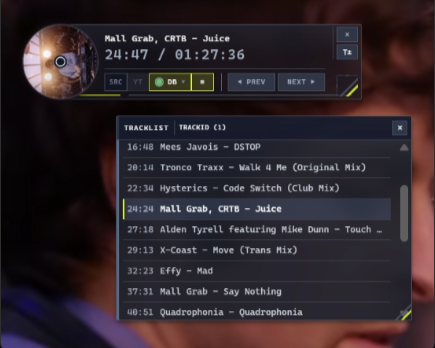
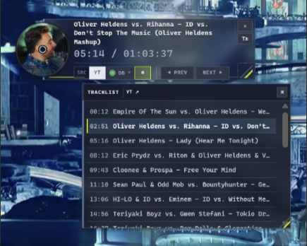
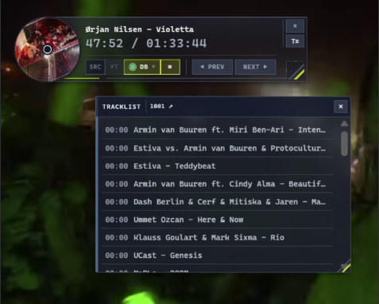
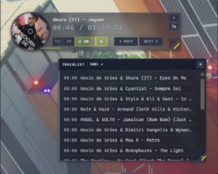
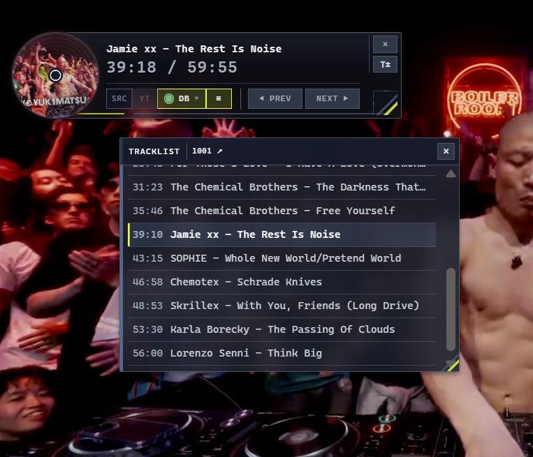
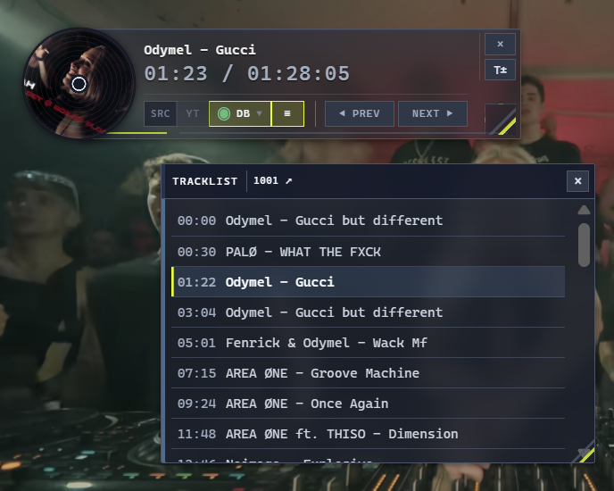

# Cue Fox · YouTube Track HUD

旧称 **YouTube CD HUD**。中国語名は **曲狐**。Repository slug は `youtube-cd-hud` のままです。

YouTube の DJ セット、ミックス、音楽動画に、複数の情報源を切り替えられる再生位置同期トラックリスト HUD を追加します。

[English](README.md) · [繁體中文](README.zh-tw.md) · [インターフェース言語ガイド](docs/i18n.ja.md)


> トラックリストを見つけ、再生位置に合わせ、現在の曲を表示します。

[](package.json)
[](extension/manifest.json)
[](src/youtube-cd-hud.user.js)

## 再生中の表示

<table>
  <tr>
    <td width="33.33%" valign="top">
      
      <br />
      <sub>01 · TrackId.net の結果と現在の曲の強調表示</sub>
    </td>
    <td width="33.33%" valign="top">
      
      <br />
      <sub>02 · YouTube のタイムスタンプ曲目と再生位置の同期</sub>
    </td>
    <td width="33.33%" valign="top">
      
      <br />
      <sub>03 · 情報源表示と現在の曲の状態</sub>
    </td>
  </tr>
  <tr>
    <td width="33.33%" valign="top">
      
      <br />
      <sub>04 · DJ セット上に表示するコンパクトな HUD</sub>
    </td>
    <td width="33.33%" valign="top">
      
      <br />
      <sub>05 · 長いセット向けの展開トラックリスト</sub>
    </td>
    <td width="33.33%" valign="top">
      
      <br />
      <sub>06 · スクロール可能なトラックリストと同期中の HUD</sub>
    </td>
  </tr>
</table>

*過去の再生画面です。今回の変更のライブ動作検証を示すものではありません。*

[HDR 元画像](docs/assets/readme/youtube-cd-hud-cue-fox-sync-hdr.jpg) · [新しいレイアウト操作の説明（English）](README.md#shape-your-layout)

---

## 目次

- [プロジェクトの状態](#プロジェクトの状態)
- [できること](#できること)
- [使用中のプレビュー](#使用中のプレビュー)
- [インストール方法を選ぶ](#インストール方法を選ぶ)
- [クイックスタート](#クイックスタート)
- [トラックリストの情報源と照合](#トラックリストの情報源と照合)
- [1001Tracklists のブラウザー認証](#1001tracklists-のブラウザー認証)
- [インターフェースと操作](#インターフェースと操作)
- [インターフェース言語](#インターフェース言語)
- [プライバシー、権限、キャッシュ](#プライバシー権限キャッシュ)
- [開発と検証](#開発と検証)
- [プロジェクト構成](#プロジェクト構成)

---

## プロジェクトの状態

YouTube CD HUD は現在、**ソースコードのみのベータ版**として提供されています。Userscript と Manifest V3 Chrome 拡張機能の現在のソースバージョンは、ともに **5.12.0** です。

このリポジトリには Chrome ウェブストア版はありません。Chrome 版はパッケージ化されていない拡張機能として読み込み、Userscript は Tampermonkey からインストールします。

## できること

YouTube CD HUD は複数のトラックリスト情報源を検索、整理、切り替え、選択したトラックリストを YouTube の現在の再生位置に同期します。

- YouTube のチャプタータイトル、動画説明欄のタイムスタンプ付き曲目を利用します。
- **1001Tracklists**、**MixesDB**、**TrackId.net** を追加の情報源として検索または照会できます。
- 情報源ごとに独立した結果を保持し、取得できる根拠に基づいて候補を評価します。
- 現在の曲を強調表示し、前後の曲へ移動できます。
- 情報源を切り替えても、現在の再生位置を保持します。
- コンパクトでドラッグ可能な CD スタイル HUD とトラックリストパネルに同期結果を表示します。

YouTube 自体に利用可能な曲目情報がある場合、`YT` 情報源が既定で選ばれます。ほかのサービスは、独立して切り替えられる情報源として追加されます。

## 使用中のプレビュー

[ページ冒頭の再生中の表示](#再生中の表示)に、6 枚のスクリーンショットを掲載しています。

---

## インストール方法を選ぶ

どちらの形式も同じ Userscript ソースを使いますが、用途が異なります。

| 選択肢 | 向いている人 | 利用できるもの |
| --- | --- | --- |
| **Tampermonkey Userscript** | 特にすでに Userscript を使っていて、すぐ試したい人 | YouTube に注入される単一スクリプト |
| **Chrome 拡張機能** | 専用の設定ページとパッケージ化されたブラウザー権限を使いたい人 | Manifest V3 拡張機能、設定ページ、バックグラウンド要求処理、1001Tracklists の第一者認証ブリッジ |

### A. Tampermonkey

1. ブラウザーに Tampermonkey をインストールします。
2. [`src/youtube-cd-hud.user.js`](src/youtube-cd-hud.user.js) を開きます。
3. Tampermonkey でそのファイルをインストールまたはインポートします。
4. 以前の YouTube CD HUD があれば無効にします。
5. YouTube タブを完全に再読み込みします。

### B. Chrome 拡張機能

現在リポジトリにある拡張機能を使うだけなら、ビルドは不要です。

1. このリポジトリをダウンロードして展開します。
2. `chrome://extensions` を開きます。
3. **デベロッパーモード**を有効にします。
4. **パッケージ化されていない拡張機能を読み込む**を選びます。
5. リポジトリの `extension/` フォルダーを選択します。
6. プロバイダー、外観、操作を変更したい場合は拡張機能の設定ページを開きます。
7. すでに開いている YouTube タブを再読み込みします。

YouTube タブでツールバーアイコンを1回クリックすると HUD の表示を切り替えます。素早くダブルクリックすると、HUD の最終表示状態を変えずに設定ページを開きます。アイコンを右クリックして、Chrome の拡張機能メニューから **Open settings** を選ぶこともできます。

> [!NOTE]
> `npm run build:extension` は、共有ソースを変更した開発者向けのコマンドです。リポジトリ内の既存 `extension/` を読み込む通常の利用者は実行する必要がありません。

## クイックスタート

1. YouTube で DJ セット、ミックス、ラジオ録音、または音楽動画を開きます。
2. YouTube のチャプターまたは説明欄にタイムスタンプ付き曲目がある場合、YouTube CD HUD はまず `YT` 情報源として読み込みます。
3. 情報源コントロールで `1001`、`MIXESDB`、`TRACKID` を検索または切り替えます。
4. プロバイダーに信頼できる候補が複数ある場合は、結果を選びます。
5. 動画を再生またはシークします。現在の曲、強調表示、ナビゲーション先が再生時刻に追従します。
6. 必要に応じて情報源を切り替えます。情報源の変更で動画をシークすることはありません。

同じプロバイダーから複数の信頼できる候補が返された場合、情報源操作には `(1)`、`(2)` などが表示されます。繰り返しクリックすると候補を順に切り替え、最後の候補の次でその情報源ページを開きます。

## トラックリストの情報源と照合

YouTube CD HUD は、各情報源から得られる YouTube ID、タイトル、動画時間、タイムスタンプ、キューの網羅度を評価して候補を順位付けします。

| 情報源 | 主な根拠 | 照合とフォールバック |
| --- | --- | --- |
| `YT` | YouTube のチャプターまたは説明欄のタイムスタンプ付き曲目 | 外部照合は不要です。利用できる場合は優先されます。 |
| `1001` | 正規化した動画タイトル、1001Tracklists の検索順位、候補ページのタイムスタンプ | タイトルと補助的な時間情報で候補を評価します。短縮された録画でも長いイベントのトラックリストと一致する場合があります。 |
| `MIXESDB` | 利用できる場合は完全一致の YouTube ID | フォールバック候補には保守的なタイトル、時間、キュー網羅度の確認が必要です。 |
| `TRACKID` | 利用できる場合は完全一致の YouTube ID | フォールバック候補はタイトルと時間を確認します。短い単曲動画ではアーティスト、曲名、バージョンを公開曲目索引と照合する場合があります。 |

各プロバイダーのトラックリストは独立して保持されるため、情報源を切り替えて比較できます。

## 1001Tracklists のブラウザー認証

1001Tracklists は CAPTCHA、ブラウザー認証ページ、IP 制限を返す場合があります。Chrome 拡張機能では、**OPEN 1001** を選び、開いた 1001Tracklists ページで認証を完了してから、元の YouTube タブに戻ります。

拡張機能は、すでに認証された第一者タブを通じて再試行できます。この短時間のブリッジは、元の YouTube タブに関連付けられた許可済みの 1001Tracklists 要求だけを受け付けます。ブロックを検出すると自動再試行は停止し、認証後に手動で再試行できます。

## インターフェースと操作

HUD には現在の曲、選択中の情報源、再生同期の状態が表示され、曲送り、シーク、外観調整の操作をまとめています。

- ドラッグ可能な CD スタイル HUD
- 現在の YouTube サムネイルから作る円形アートワーク
- カバーに基づくアクセントカラー
- 現在の曲名と情報源表示
- 前後の曲への移動、トラックリスト内の現在曲強調表示、ディスクによるシーク
- HUD 幅と文字サイズの調整
- プロバイダー、書体、ディスク倍率、パネル不透明度、アクセントカラー、表示コントロール、カスタム CSS を設定できる専用拡張機能設定ページ

## インターフェース言語

Chrome 拡張機能のインターフェースは、繁体字中国語（台湾）、英語、日本語に対応しています。設定ページで「自動検出」を選ぶとブラウザーの優先言語を使用し、対応言語を選ぶと現在の Chrome プロファイルでその言語を固定できます。自動モードで対応言語が得られない場合は、繁体字中国語（台湾）にフォールバックします。

翻訳済みの対象には、設定ページと HUD の表示コントロール、状態テキスト、アクセシビリティラベルが含まれます。プロバイダー名、コマンド、情報源識別子、カスタム CSS は翻訳されません。

検出順序、保存動作、コントリビューター向けの詳細は、[インターフェース言語ガイド](docs/i18n.ja.md)を参照してください。リポジトリ内のローカル検証は、Chrome、Tampermonkey、YouTube で表示を確認する受け入れテストの代わりにはなりません。


## プライバシー、権限、キャッシュ

Chrome 拡張機能は、ローカル設定用の `storage` と、ツールバーアイコンの **Open settings** メニュー用の `contextMenus` を要求します。ホストアクセスは YouTube、1001Tracklists、MixesDB、TrackId.net に限定されます。

このプロジェクトは Chrome の `cookies` 権限を要求せず、`chrome.cookies` を呼び出さず、閲覧履歴を収集せず、分析機能も含みません。許可済みの 1001Tracklists 要求では、そのサイトの認証 Cookie がブラウザーにより添付されることがありますが、拡張機能が Cookie 値を読み取り、保存し、公開することはありません。

MixesDB と TrackId.net の要求は匿名の読み取り専用です。音声をアップロードしたり、新しい音声認識ジョブを送信したりしません。解析済みの曲目データと情報源リンクは、最長 **6 時間**、最近 **30 本**の動画、プロバイダーあたり **300 曲**までローカルにキャッシュされます。第三者 HTML、Cookie、認証チャレンジのデータはキャッシュしません。

## 開発と検証

共有ソースは次にあります。

```text
src/youtube-cd-hud.user.js
```

パッケージ化された Chrome 拡張機能は次にあります。

```text
extension/
```

共有ソースを変更した後は、次を実行します。

```powershell
npm run build:extension
npm run check
npm test
```

`npm run check` は、拡張機能のコンテンツスクリプトが Userscript ソースと同期していることを確認し、JavaScript の構文チェックを実行します。`npm test` は Node.js テストスイートを実行します。

これらの検証はリポジトリを確認しますが、最終受け入れには、Userscript またはパッケージ化されていない拡張機能をインストールしたブラウザープロファイルで、実際の YouTube 動画を表示して確認する必要があります。

## プロジェクト構成

| パス | 目的 |
| --- | --- |
| `src/youtube-cd-hud.user.js` | 共有 Userscript ソース |
| `extension/` | Manifest V3 Chrome 拡張機能 |
| `extension/icons/` | Chrome 拡張機能アイコン（16、32、48、128 px） |
| `extension/options/` | 拡張機能設定インターフェース |
| `extension/background/` | バックグラウンド要求処理 |
| `extension/content/` | YouTube コンテンツスクリプトと 1001 第一者タブブリッジ |
| `extension/shared/i18n.js` | 拡張機能インターフェースのロケールカタログと翻訳ヘルパー |
| `scripts/build-extension.mjs` | 共有ソースを `extension/` に同期 |
| `tests/` | Node.js テストスイート |
| `docs/assets/readme/` | README のイラストとスクリーンショット |
| `archive/` | 過去のプロジェクト資料 |

## 注記

YouTube、1001Tracklists、MixesDB、TrackId.net、Chrome、Tampermonkey は第三者の製品またはサービスです。YouTube CD HUD は独立したソースプロジェクトであり、これらのサービスの公式統合として提示するものではありません。
