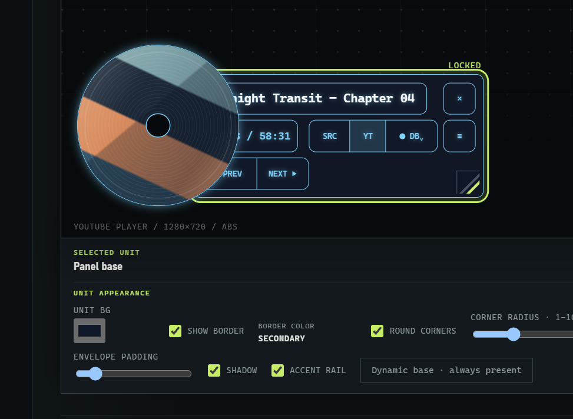

# Cue Fox · YouTube Track HUD

Previously **YouTube CD HUD** · 中文名稱：**曲狐**. Repository and install paths remain `youtube-cd-hud`.

Turn YouTube DJ sets, mixes, and music videos into a synchronized tracklist HUD with switchable data sources.

[繁體中文](README.zh-tw.md) · [日本語](README.ja.md) · [Interface language guide](docs/i18n.md)


> Find the tracklist. Match the timeline. Stay on the current track.

[](package.json)
[](extension/manifest.json)
[](src/youtube-cd-hud.user.js)

## See it during playback

<table>
  <tr>
    <td width="33.33%" valign="top">
      
      <br />
      <sub>01 · Active-track highlight with a TrackId.net result</sub>
    </td>
    <td width="33.33%" valign="top">
      
      <br />
      <sub>02 · YouTube timestamp tracklist in sync with playback</sub>
    </td>
    <td width="33.33%" valign="top">
      
      <br />
      <sub>03 · Source indicator and current-track state</sub>
    </td>
  </tr>
  <tr>
    <td width="33.33%" valign="top">
      
      <br />
      <sub>04 · Compact HUD over a live DJ set</sub>
    </td>
    <td width="33.33%" valign="top">
      
      <br />
      <sub>05 · Expanded tracklist view for longer sets</sub>
    </td>
    <td width="33.33%" valign="top">
      
      <br />
      <sub>06 · Scrollable tracklist with synchronized HUD state</sub>
    </td>
  </tr>
</table>

*Restored from the previous README. This is a historical playback screenshot, not a capture of the new editor or a new live-browser acceptance result.*

<details>
<summary>Original HDR artwork</summary>


[Original HDR sync artwork](docs/assets/readme/youtube-cd-hud-cue-fox-sync-hdr.jpg) · [Original HDR interface artwork](docs/assets/readme/youtube-cd-hud-cue-fox-interface-hdr.jpg) · [Asset preservation guide](docs/assets/readme/ASSETS.md)

The new banner is an SDR concept illustration. Original HDR JPEG files remain unchanged; HDR display depends on the browser, image delivery path and display.

</details>

## Shape your layout

New layouts start with **relative % sizing on a 1280 × 720 canvas**. Existing layouts retain their saved sizing mode; older pixel layouts without a mode remain absolute, and can be switched to REL · % without changing their current geometry. Stored widths and heights remain canvas pixels for compatibility; the editor converts them to percentages.

- Compact controls can reach 32px height instead of 48px; text containment still sets a larger minimum when needed.
- **SCALE %** scales all components, the selected component, or its overlapping group around their shared center. Split controls and layer order are retained. The panel base follows its contents.
- Scaling preserves relative positions and disables auto alignment to avoid independent rounding. Enable AUTO ALIGN again when you want grid snapping.
- Size, text, collision and canvas limits may reject a scale. **UNDO** restores the layout immediately before the last scale, including alignment, unless further edits have occurred. Use the page's Save action to persist the result.

---

## Table of Contents

- [Project Status](#project-status)
- [What It Does](#what-it-does)
- [Layout Editor Preview](#layout-editor-preview)
- [Choose an Installation](#choose-an-installation)
- [Quick Start](#quick-start)
- [Track Sources and Matching](#track-sources-and-matching)
- [1001Tracklists Verification](#1001tracklists-verification)
- [Interface and Controls](#interface-and-controls)
- [Interface Language](#interface-language)
- [Privacy, Permissions, and Cache](#privacy-permissions-and-cache)
- [Development and Verification](#development-and-verification)
- [Project Layout](#project-layout)

---

## Project Status

YouTube CD HUD is currently distributed as a **source-only beta**. The current source version is **5.14.0** for both the userscript and the Manifest V3 Chrome extension.

There is no Chrome Web Store package documented by this repository. The Chrome build is loaded as an unpacked extension; the userscript is installed through Tampermonkey.

---

## What It Does

YouTube CD HUD discovers, organizes, and switches between multiple tracklist sources, then synchronizes the active track with the current YouTube playback position.

It can:

- Use YouTube's own native chapter title or timestamped tracks from the video description.
- Search or query additional tracklist sources including **1001Tracklists**, **MixesDB**, and **TrackId.net**.
- Keep an independent result set for each provider and rank credible candidates using the evidence available from that source.
- Match the selected tracklist to the current YouTube playback position.
- Highlight the active track and provide previous / next track navigation.
- Preserve the current playback position while switching data sources.
- Present the synchronized result in a compact, draggable CD-style HUD and tracklist panel.

When YouTube already provides usable track information, the `YT` source remains the default. Other services are added as independent, switchable sources.

---

## Layout Editor Preview



*Actual options-page detail: select a component to edit its properties below the canvas. The track text is sample preview content, not live YouTube playback; this crop illustrates editing controls rather than the current built-in panel arrangements.*

---

## Choose an Installation

Both variants use the same core userscript source, but they fit different workflows.

| Option | Best for | What you get |
| --- | --- | --- |
| **Tampermonkey userscript** | The fastest way to try the project, especially if you already use userscripts | A single script injected on YouTube |
| **Chrome extension** | Users who want the dedicated settings page and packaged browser permissions | Manifest V3 extension, options page, background request handling, and the 1001Tracklists first-party verification bridge |

### Option A — Tampermonkey

1. Install Tampermonkey in your browser.
2. Open [`src/youtube-cd-hud.user.js`](src/youtube-cd-hud.user.js).
3. Install or import that file into Tampermonkey.
4. Make sure older copies of YouTube CD HUD are disabled.
5. Reload the YouTube tab completely.

### Option B — Chrome extension

No build step is required just to use the current checked-in extension.

1. Download this repository and extract it.
2. Open `chrome://extensions`.
3. Enable **Developer mode**.
4. Choose **Load unpacked**.
5. Select the repository's `extension/` folder.
6. Open the extension's options page if you want to change providers, appearance, or controls.
7. Reload any YouTube tabs that were already open.

On a YouTube tab, click the toolbar icon once to show or hide the HUD. Double-click it quickly to open the settings page without changing the final HUD visibility. You can also right-click the icon and choose **Open settings** from Chrome's native extension menu.

> [!NOTE]
> `npm run build:extension` is a **developer** command used after changing the shared source. Ordinary users loading the current repository do not need to run it.

---

## Quick Start

1. Open a YouTube DJ set, mix, radio recording, or music video.
2. If YouTube provides chapters or timestamped description tracks, YouTube CD HUD loads them as the `YT` source first.
3. Use the source control to query or switch to `1001`, `MIXESDB`, or `TRACKID`.
4. Select a result when a provider has multiple credible candidates.
5. Play or scrub the YouTube video. The active track, highlight, and navigation targets follow the current playback time.
6. Switch source whenever needed. Source changes update the visible track data without seeking the video.

When one provider returns multiple credible candidates, the source action displays `(1)`, `(2)`, and so on. Repeated clicks move through the candidates; after the final candidate, one more click opens that source page.

---

## Track Sources and Matching

YouTube CD HUD evaluates each source with the evidence it provides, including YouTube IDs, titles, video duration, timestamps, and cue coverage, then ranks candidates by confidence.

| Source | Primary evidence | Matching / fallback behavior |
| --- | --- | --- |
| `YT` | Native YouTube chapter title or timestamped description tracks | No external match is required; this remains the preferred source when available |
| `1001` | Normalized video title, ranked 1001Tracklists search results, timestamped candidate pages | Candidate ranking uses title evidence and supporting timing information; shortened recordings can still match a longer event tracklist |
| `MIXESDB` | Exact YouTube ID when available | Fallback candidates must satisfy conservative title, duration, and cue-coverage checks |
| `TRACKID` | Exact YouTube ID when available | Fallback candidates use title and duration checks; short single-track videos may use artist / title / version matching against the public music-track index |

Each provider's tracklist remains independent so users can switch between sources and compare results.

### Source behavior at a glance

| Situation | Behavior |
| --- | --- |
| YouTube description contains timestamped tracks | Loads them as `YT` and uses them by default |
| YouTube exposes a native chapter title | Displays the current chapter while `YT` is active |
| 1001Tracklists returns a usable timestamped tracklist | Adds a selectable `1001` source synchronized to the same playback time |
| MixesDB or TrackId.net returns a trusted match | Adds that provider as a separate selectable source |
| More than one source is available | Keeps `YT` active by default unless the saved preference selects 1001 after a successful search |
| A remote provider is blocked or has no credible result | Continues using the available local / YouTube data and preserves the current synchronized result |

---

## 1001Tracklists Verification

1001Tracklists may return a CAPTCHA, browser verification page, or IP-limit response.

For the **Chrome extension**:

1. Choose **OPEN 1001**.
2. Complete any browser verification on the opened 1001Tracklists page.
3. Let the result page finish loading.
4. Return to the original YouTube tab.

The extension can then retry through the already verified first-party tab. The short-lived bridge only accepts allowlisted 1001Tracklists requests associated with the originating YouTube tab.

Automatic 1001 retries pause after a detected block, while manual retry remains available after verification.

---

## Interface and Controls

The HUD brings the current track, selected source, and playback synchronization state into one view, with controls for navigation, scrubbing, and appearance.


*The two Cue Fox illustrations are concept artwork, supplied as original HDR JPEGs. See the layout editor screenshot above for actual UI.*

The HUD uses circular YouTube thumbnail artwork. Live Monitor lets you arrange component positions, dimensions, text, and styling on the player canvas.

| Control | How to use it |
| --- | --- |
| Source | Choose `YT` for YouTube tracks, or open `DB ▼` to search/select `1001`, `MIXESDB`, or `TRACKID`. Switching sources keeps the playback position. |
| Previous / next | Use `◀ PREV` / `NEXT ▶` (labels follow the interface language) to jump between timestamped tracks in the selected source. |
| Tracklist panel | Press `≡` to toggle the floating list. A list placed in the Composer layout stays visible until removed from that layout. Click a timestamped row to seek to its cue. |
| Disc scrubbing | Hold and rotate the disc: clockwise fast-forwards; counter-clockwise loops a short sample. Release to resume playback. |

### Layout and controls

| Feature | Operation |
| --- | --- |
| Built-in panels | Choose **Compact playback** or **Tracklist reader** to load an editable starting layout. The reader includes a larger disc and a fixed tracklist. |
| Select and arrange | Select a component, drag it, or resize it with the wheel or corner handles. Use **AUTO ALIGN** for grid snapping. |
| Component properties | The toolbar below the canvas exposes the selected unit's text, colors, opacity, border, corners, and supported effects. Borders stay at 1px when resized. |
| Layers and collisions | Enable Z layers to overlap units. A conflicting drag offers automatic layer allocation or returns the conflicting units to the Component List. |
| Component List | Add missing units or remove optional ones with Delete. The panel base is retained and follows the boundaries of the placed controls. |
| Temporary A/B/C slots | Select a slot and use **SAVE / LOAD** for this browser session. These are separate from the bundled panels and from persistent **Save and apply**. |

### Options page workflow

1. **Sources:** configure provider switches, automatic 1001 lookup, timeout, and candidate limits on the left.
2. **Layout:** choose a built-in panel and edit it in Live Monitor on the right. Expand **HUD appearance** or **Custom CSS** there for additional settings; scope CSS to `#yt-cd-hud` or `.yt-tracklist-panel`.
3. **Apply:** use **Save and apply**, fixed at the bottom of the window, to persist settings and layout. Choosing a preset only changes the preview until saved; it does not overwrite A/B/C slots.

See the [Live Monitor Visual Composer guide](docs/live-monitor-visual-composer.md) for the full editor workflow and layout constraints.

## Interface Language

The Chrome extension interface supports Traditional Chinese (Taiwan), English, and Japanese. In the options page, choose **Automatic** to use the browser's preferred language, or select one of the supported languages to keep it fixed for the current Chrome profile. Automatic mode falls back to Traditional Chinese (Taiwan) when no supported language is available.

The translated extension surfaces include the options page and the HUD's visible controls, status text, and accessibility labels. Provider names, commands, source identifiers, and custom CSS are not translated.

See the [interface language guide](docs/i18n.md) for the exact detection order, persistence behavior, and contributor guidance. This repository's local checks do not replace a visible Chrome, Tampermonkey, and YouTube acceptance check.

---

## Privacy, Permissions, and Cache

The Chrome extension requests `storage` for local settings and `contextMenus` for the toolbar icon's **Open settings** menu. Host access is limited to:

- YouTube
- 1001Tracklists
- MixesDB
- TrackId.net

The project does **not** request the Chrome `cookies` permission, call `chrome.cookies`, collect browsing history, or include analytics.

When Chrome sends an allowlisted request to 1001Tracklists, the browser may attach that site's own verification cookies. The extension does not read, store, or expose those cookie values.

MixesDB and TrackId.net requests are anonymous and read-only. The project does not upload audio or submit a new recognition job.

Parsed track data and source links may be cached locally for up to **six hours**, bounded to **30 recent videos** and **300 tracks per provider**. Third-party HTML, cookies, and challenge data are not stored in that cache.

## Development and Verification

The shared source is:

```text
src/youtube-cd-hud.user.js
```

The generated / packaged Chrome extension is under:

```text
extension/
```

After changing the shared source:

```powershell
npm run build:extension
npm run check
npm test
```

`npm run check` verifies that the extension content script is synchronized with the userscript source and runs JavaScript syntax checks. `npm test` runs the Node.js test suite.

These checks validate the repository, but final acceptance still requires a visible test on a real YouTube video in the browser profile where the userscript or unpacked extension is installed.

---

## Project Layout

| Path | Purpose |
| --- | --- |
| `src/youtube-cd-hud.user.js` | Shared userscript source |
| `extension/` | Manifest V3 Chrome extension |
| `extension/icons/` | Chrome extension icons (16, 32, 48, and 128 px) |
| `extension/options/` | Extension settings UI |
| `extension/shared/i18n.js` | Extension-interface locale catalogs and translation helper |
| `extension/background/` | Background request handling |
| `extension/content/` | YouTube content script and 1001 first-party bridge |
| `scripts/build-extension.mjs` | Keeps extension output synchronized with the shared source |
| `tests/` | Node.js test suite |
| `docs/assets/readme/` | README artwork and screenshots |
| `archive/` | Historical project material |

---

## Notes

YouTube, 1001Tracklists, MixesDB, TrackId.net, Chrome, and Tampermonkey are third-party products or services. YouTube CD HUD is an independent source project and is not presented as an official integration of those services.
