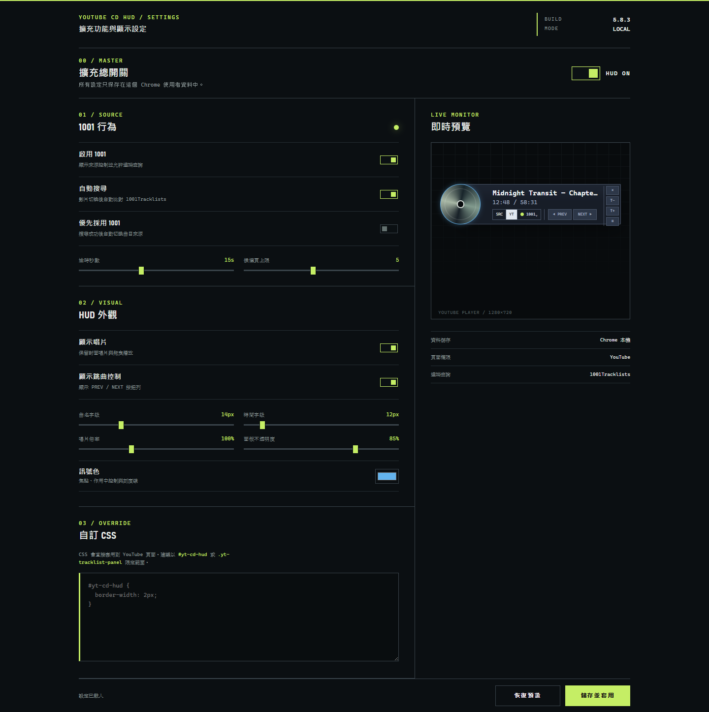
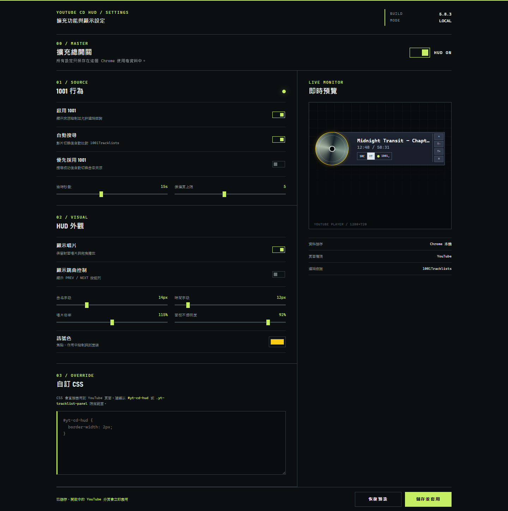

# YouTube CD HUD


[繁體中文](README.zh-tw.md)

YouTube CD HUD searches selectable tracklist providers for the current YouTube
video, imports timestamped tracks, and keeps the active track synchronized with playback. It
also works with YouTube's native chapter title and timestamped tracks parsed
from the video description, so existing YouTube track information remains the
default instead of being replaced.

The synchronized track controls are presented through an album-style HUD and
tracklist panel. The project is available as both a Tampermonkey userscript and
a Manifest V3 Chrome extension.

The current userscript source is `src/youtube-cd-hud.user.js`. The unpacked
Chrome extension is in `extension/`. Both variants are version 5.9.0.

## Highlights

- Searches 1001Tracklists with the normalized YouTube video title, ranks matching
  results, and tries timestamped candidate tracklists in order.
- Offers manual, independent MixesDB and TrackId.net lookups. Exact YouTube IDs
  are preferred; fallback candidates must also pass title and duration checks.
- Synchronizes the selected tracklist with the YouTube playback position,
  highlights the current track, and provides previous/next track navigation.
- Preserves compatibility with YouTube's own chapter title and timestamped video
  description tracks. You can switch between `YT` and `1001`; YouTube remains
  preferred by default when both sources are available.
- Handles 1001Tracklists CAPTCHA or IP-limit responses explicitly, pauses
  automatic retries for five minutes, and keeps manual retry available after
  site verification.
- Presents the synchronized data in a draggable, scalable album-style HUD with
  circular thumbnail artwork, cover-derived accent color, tracklist panel, and
  direct disc scrubbing.

## Track-source synchronization

| Situation | Behavior |
|---|---|
| YouTube description contains timestamped tracks | Loads them as the `YT` source and uses them by default. |
| YouTube exposes a native chapter title | Shows that chapter title while the `YT` source is active. |
| 1001Tracklists finds timestamped tracks | Adds a selectable `1001` source synchronized to the same video time. |
| MixesDB or TrackId.net finds a trusted match | Adds an independent selectable source; it is not merged into another provider's data. |
| Multiple sources are available | Keeps `YT` active by default; `Prefer 1001` can switch automatically after a successful 1001 search. |
| 1001Tracklists is blocked or has no usable result | Keeps the available YouTube source and reports the 1001 search state instead of replacing it. |

Changing source updates the visible tracklist, active-track highlight, current
track title, and previous/next targets without changing YouTube playback time.

## Install

### Tampermonkey

1. Import `src/youtube-cd-hud.user.js` into Tampermonkey.
2. Disable older copies of the script.
3. Fully reload the YouTube tab.

### Chrome extension

1. Run `npm run build:extension` after changing the shared userscript source.
2. Open `chrome://extensions`, enable Developer mode, and choose **Load unpacked**.
3. Select this repository's `extension/` directory.
4. Open the extension control page, save the preferred settings, and reload any
   YouTube tabs that were already open.

The extension is source-distributed and is not presented here as a Chrome Web
Store release.

## Control page

The control page manages the HUD switch, enabled tracklist providers, 1001Tracklists behavior, typography,
disc scale, panel opacity, accent color, visible controls, and custom CSS. Scope
custom selectors to `#yt-cd-hud` or `.yt-tracklist-panel` where practical.



The following capture records an actual control-page operation: the accent was
changed to yellow, disc scale to 115%, panel opacity to 92%, transport controls
were hidden, and the settings form reported a successful save.



These captures execute the repository's real `options.html`, `options.css`,
`settings.js`, and `options.js`. A bounded in-memory adapter substitutes only
for `chrome.storage.local`, so no personal Chrome profile or browsing data is
used. They verify the control-page interaction, not installation or behavior on
a live YouTube tab.

## Privacy and permissions

- Extension preferences stay in Chrome local storage.
- The manifest requests `storage` and limits host access to YouTube,
  1001Tracklists, MixesDB, and TrackId.net HTTPS pages.
- The extension has no `cookies` permission and does not call `chrome.cookies`,
  read cookie values, or log them.
- When 1001Tracklists integration is enabled, Chrome may attach that site's own
  verification cookies to allowlisted HTTPS requests. The extension cannot read
  those cookie values.
- MixesDB and TrackId.net requests are anonymous read-only requests with
  credentials omitted. The extension does not submit audio or request new recognition.
- No browsing history, credentials, or analytics are collected by the project.

## Mascot

Vinyl Sentinel is the project's original vinyl-disc guardian. The yellow wrist,
rim, and boot accents echo a high-visibility cue marker while the cyan and
magenta lighting retains the HUD's industrial telemetry character.


The mascot and scenes are original generated artwork for this project. They do
not reproduce third-party characters, logos, or interface screenshots.

## Development and validation

```powershell
npm run check
npm test
```

`npm run check` verifies that the generated extension content script matches the
userscript source and runs JavaScript syntax checks. `npm test` runs the Node.js
test suite. These are local checks; final acceptance still requires a visible
YouTube video test with the userscript or unpacked extension in the operator's
actual browser profile.

## Release notes

### 5.9.0

- Adds selectable MixesDB and TrackId.net providers behind independent adapters.
- Keeps both supplemental lookups manual and read-only. Candidate acceptance uses
  source URL or YouTube ID evidence plus conservative title, duration, and cue-coverage checks.
- Keeps provider tracklists separate so the operator explicitly chooses the active source.

### 5.8.3

- Lets extension-background requests reuse Chrome's existing 1001Tracklists site
  verification state, fixing the case where the page is readable in a normal tab
  while background lookup still receives the CAPTCHA block page.
- Adds no `cookies` permission and never reads, stores, or logs cookie values.
  Chrome may only attach 1001Tracklists' own cookies to the existing HTTPS
  allowlisted requests.

### 5.8.2

- Makes “Show disc” a visual-only toggle: hiding the disc preserves its layout
  footprint, the panel centerline, and every title/control position. The settings
  preview follows the same behavior.
- Paces the first 1001 candidate request and every fallback by 1.2 seconds instead
  of sending candidate-page requests back-to-back.
- Pauses automatic 1001 lookup for five minutes after an IP/CAPTCHA block page;
  `RETRY SEARCH` remains available immediately after the operator completes the
  site challenge.
- Restores normal browser caching for extension background requests and adds
  phase, candidate, HTTP status, and URL diagnostics without reading or sending
  Chrome cookies.

### 5.8.1

- Locks the HUD box to its complete natural content dimensions. The bottom-right
  handle now scales the HUD proportionally instead of stretching an empty panel.
- Starts the opaque panel at the disc centerline, leaving the disc's outer half
  naturally overhanging. The surrounding left rectangle is fully transparent
  and pointer-through, while the disc remains tangent to the panel's top and
  bottom edges.
- Keeps the default disc slightly taller than the adjacent title, time, and
  control stack, and adds a pointer-tracked reflective highlight that yields to
  the existing disc-scrubbing interaction.
- Places the source selector and fixed-width previous/next controls on one row,
  separated by a restrained divider and gap.
- When 1001 is active, uses only the current 1001 track title instead of allowing
  YouTube system chapter labels such as video information to override it.
- Makes the extension's 1001 background bridge more compatible and diagnosable
  with callback-based replies, phased errors, and an explicit timeout.

### 5.8.0

- Adds a Manifest V3 Chrome extension while keeping the Tampermonkey build.
- Adds a dedicated extension control page for enabling the HUD, changing 1001
  search behavior, tuning typography, disc scale, opacity and accent color,
  hiding selected controls, and applying custom CSS. Authors are encouraged to
  scope selectors to `#yt-cd-hud` or `.yt-tracklist-panel`.
- Stores extension preferences locally and applies changes to open YouTube tabs.
- Keeps cross-site access limited to YouTube and 1001Tracklists; no browsing
  history, credentials, cookie values, or analytics are collected. Chrome may
  attach existing 1001 verification cookies, but the extension cannot read them.

### 5.7.1

- Adds balanced whitespace on both sides of the disc and enlarges its default
  diameter to 120% of the previous size.
- Dynamically locks the HUD's minimum complete width and height to the current
  track text, disc, source controls, transport buttons, and utility rail, while
  retaining the YouTube player as the maximum available boundary.

### 5.7.0

- Turns the 1001 status/source control into one compound disclosure button.
  Its menu contains `USE 1001`, `RETRY SEARCH`, and `OPEN 1001` actions.
- Moves the tracklist toggle into the right-side utility rail and adds
  `PREV`/`NEXT` track navigation below the source controls.
- Balances the disc against both the viewport and selected text size, with
  additional interior spacing so the disc and controls do not touch the frame.
- Adds a title bar and top-right close button to the tracklist panel.
- Keeps both the HUD and tracklist panel draggable and adds visible bottom-right
  resize handles for pointer resizing within the YouTube player.

### 5.6.0

- Fixes the tracklist toggle by explicitly switching the panel between
  `display: block` and `display: none` instead of falling back to its hidden
  stylesheet state.
- Removes manual disc-size controls and sizes the disc responsively from the
  viewport's shorter dimension, clamped between 44 and 64 pixels.
- Places close, text decrease, and text increase controls in one vertically
  aligned utility rail at the top right.
- Rebuilds the source controls as a compact labelled action row containing an
  always-visible `SRC | YT | 1001` selector, circular 1001 status lamp,
  `1001↗` link, and `TRACKS` toggle. Unavailable sources remain visible but
  disabled, while the active source is highlighted.

### 5.5.2

- Detects 1001Tracklists' native rate-limit CAPTCHA page, including successful
  HTTP 200/206 responses that contain its `unblock_ip` form.
- Stops candidate fallback immediately when that block page is detected and
  reports that browser verification is required instead of claiming that five
  tracklists contain no timestamps.

### 5.5.1

- Restores the status indicator to a circular lamp while preserving its idle,
  searching, success, error, and keyboard-focus states.
- Accepts every successful HTTP 2xx response from 1001Tracklists, including
  HTTP 206, before applying the existing HTML, block-page, and timestamp
  validation.
- Adds direct disc scrubbing: hold to pause, drag clockwise to seek forward,
  drag counterclockwise to loop an 80 ms sample, and release to resume.
- Adds a top-right close button that hides the HUD and tracklist panel until the
  YouTube tab is reloaded.

### 5.5.0

- Crops a native 16:9 YouTube thumbnail with `background-size: cover`, so the
  artwork fills the circular disc without exposed edges or 4:3 letterboxing.
- Applies a compact industrial telemetry design system with hard edges,
  slate-toned glass surfaces, monospace data, accessible status colors, and
  consistent control states.
- Keeps cover-derived color on the disc rim only, preserving stable HUD
  contrast and hierarchy.
- Adds keyboard focus treatment, reduced-motion support, and a tighter layout
  for narrow viewports.

### 5.4.1

- Uses the scoped Trusted Types policy with the inert DOM parser before
  Chrome's sanitizing `Document.parseHTML()` fallback. The sanitizer removes
  the current 1001Tracklists track rows even though the source HTML contains
  valid cues.

### 5.4.0

- Uses the current 1001Tracklists POST search contract.
- Normalizes common YouTube title suffixes before searching.
- Ranks tracklist results by title-token similarity.
- Tries up to five candidate tracklist pages when an earlier result has no
  usable timestamps.
- Reads cue time from visible timestamp text, hidden `cue_seconds` inputs, or
  cue action metadata.
- Cancels stale requests and clears timers during YouTube SPA navigation.
- Keeps Trusted Types parsing scoped and never inserts third-party parsed DOM
  into the YouTube page.
