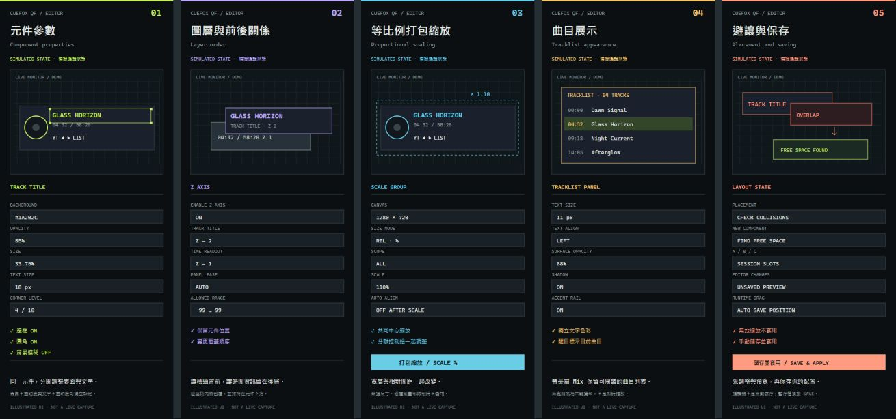
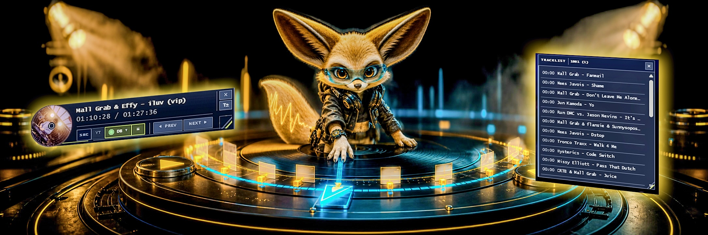

# CueFox QF · YouTube 曲目 HUD

為 YouTube DJ Set、Mix 與音樂影片加入**可切換資料來源、並隨播放進度同步的曲目 HUD**。

[English](README.md) · [日本語](README.ja.md) · [介面語言說明](docs/i18n.zh-tw.md)


> 找到曲目資料、對齊播放時間軸，讓 HUD 隨播放進度持續顯示正確曲目。

[](package.json)
[](extension/manifest.json)
[](src/youtube-cd-hud.user.js)

## 播放曲目時的樣式

<table>
  <tr>
    <td width="33.33%" valign="top">
      
      <br />
      <sub>01 · TrackId.net 結果與目前曲目醒目標示</sub>
    </td>
    <td width="33.33%" valign="top">
      
      <br />
      <sub>02 · YouTube 時間戳曲目與播放進度同步</sub>
    </td>
    <td width="33.33%" valign="top">
      
      <br />
      <sub>03 · 資料來源指示與目前曲目狀態</sub>
    </td>
  </tr>
  <tr>
    <td width="33.33%" valign="top">
      
      <br />
      <sub>04 · 顯示在 DJ Set 上方的精簡 HUD</sub>
    </td>
    <td width="33.33%" valign="top">
      
      <br />
      <sub>05 · 適合較長 Set 的展開曲目列表</sub>
    </td>
    <td width="33.33%" valign="top">
      
      <br />
      <sub>06 · 可捲動曲目列表與同步中的 HUD 狀態</sub>
    </td>
  </tr>
</table>

*從前一版 README 恢復的實際播放截圖。此圖為歷史介面預覽，不是新版編輯器截圖，也不代表本次已完成即時瀏覽器驗收。*

<details>
<summary>HDR 原始插圖</summary>


[HDR 同步插圖原檔](docs/assets/readme/youtube-cd-hud-cue-fox-sync-hdr.jpg) · [HDR 介面插圖原檔](docs/assets/readme/youtube-cd-hud-cue-fox-interface-hdr.jpg) · [資產保留流程](docs/assets/readme/ASSETS.zh-tw.md)

新版 Banner 為 SDR 概念插圖；既有 HDR JPEG 原檔完整保留。HDR 實際顯示效果取決於瀏覽器、圖片傳遞方式與顯示器。

</details>

## 調整你的面板

新版面預設為 **1280 × 720 畫布與相對比例 % 尺寸**。既有版面保留已儲存的模式；未記錄模式的舊 px 資料維持絕對尺寸，可切換為 REL · %，切換時保留目前幾何配置。為相容既有資料，儲存的寬高仍以畫布 px 表示，由編輯器換算百分比。

- 常用控制元件最低高度由 48px 降至 32px；文字需要更多空間時，仍會提高最低高度。
- **打包縮放 / SCALE %** 可選全部元件、選取元件或其重疊群組，以共同中心縮放尺寸與相對位置。保留分離控制鈕與圖層順序，面板底座隨內容調整。
- 縮放後關閉自動對齊，以避免元件各自取整而改變間距；需要格線吸附時可重新啟用 AUTO ALIGN。
- 達到尺寸、文字容納、碰撞或畫布邊界限制時，縮放不會套用。**復原縮放 / UNDO** 可還原上次縮放前的配置與對齊設定；若已做其他編輯，則停用復原以保留後續變更。最後使用設定頁的儲存按鈕保存結果。

---

## 目錄

- [專案狀態](#專案狀態)
- [這個專案在做什麼](#這個專案在做什麼)
- [版面編輯器預覽](#版面編輯器預覽)
- [如何選擇安裝方式](#如何選擇安裝方式)
- [快速開始](#快速開始)
- [曲目來源與比對方式](#曲目來源與比對方式)
- [1001Tracklists 的瀏覽器驗證](#1001tracklists-的瀏覽器驗證)
- [介面與控制](#介面與控制)
- [介面語言](#介面語言)
- [隱私、權限與快取](#隱私權限與快取)
- [開發與驗證](#開發與驗證)
- [專案結構](#專案結構)

---

## 專案狀態

YouTube CD HUD 目前以**原始碼 Beta 測試版**形式提供。Userscript 與 Manifest V3 Chrome 擴充功能的版本皆為 **5.14.0**。

目前尚未提供 Chrome 線上應用程式商店版本。Chrome 版需以「載入未封裝項目」方式安裝；Userscript 則透過 Tampermonkey 安裝。

---

## 這個專案在做什麼

YouTube CD HUD 會搜尋、整理並切換多個曲目資料來源，再依 YouTube 的播放位置同步顯示目前曲目。

它可以：

- 讀取 YouTube 原生章節標題，或影片說明欄中帶有時間戳的曲目資料。
- 查詢 **1001Tracklists**、**MixesDB**、**TrackId.net** 等額外曲目來源。
- 為每個資料來源保留獨立結果，並依各來源可取得的證據篩選可信候選。
- 根據 YouTube 目前播放位置，自動判斷並醒目標示正在播放的曲目。
- 提供上一曲／下一曲跳轉。
- 切換資料來源時保留目前播放位置。
- 透過可拖移的 CD 風格 HUD 與曲目列表面板呈現同步結果。

如果 YouTube 本身已有可用的章節或時間戳曲目，`YT` 會作為預設來源；其他服務則以獨立、可切換的資料來源加入。

---

## 版面編輯器預覽

五張直式模擬編輯狀態連續並排。這是依現有功能重建、為說明而重新排版的 **模擬 UI 截圖**，並非擴充功能原樣截圖或即時播放驗收。點圖可開啟可放大的向量版。

[](docs/assets/readme/editor-states/editor-states-strip.svg)

| 對照圖片 | 參數與功能說明 |
| --- | --- |
| [01 · 元件參數](docs/assets/readme/editor-states/parameters.jpg) | 表面與文字分開設定。圖中示範標題寬 **33.75%**、表面不透明度 **85%**、字級 **18px**、圓角等級 **4/10**。可依元件調整背景色、透明度、尺寸、邊框、圓角、模糊，以及文字色彩、透明度、字型、字級、對齊與效果。 |
| [02 · 圖層](docs/assets/readme/editor-states/layers.jpg) | 啟用 **Z axis**，圖中標題 **Z=2** 在時間 **Z=1** 前方，可用範圍 **−99～99**。底座自動包覆內容並留在下方。分離的上一曲／下一曲可各自定位，仍共用尺寸與外觀。 |
| [03 · 等比例縮放](docs/assets/readme/editor-states/scale.jpg) | **Size** 依目前寬高比調整單一元件；**SCALE %** 縮放全部、選取元件或重疊群組。圖中為 **1280×720／REL %／110%**。寬高、相對間距與文字一起調整；沒有獨立的「比例鎖定」開關。群組縮放會關閉自動對齊以避免取整，超出尺寸或畫布限制則不套用，可用 UNDO 復原。 |
| [04 · 曲目展示](docs/assets/readme/editor-states/tracklist.jpg) | 曲目面板可獨立設定表面與文字，並啟用陰影、側邊強調線；曲名元件支援跑馬燈。圖中為 **11px**、靠左、表面不透明度 **88%**。曲名為示範資料；實際播放依來源與播放位置醒目標示曲目，長列表可捲動。 |
| [05 · 避讓與保存](docs/assets/readme/editor-states/save.jpg) | 新增元件會搜尋空位，找不到則不加入。拖曳後若同層重疊，確認可自動配置 Z 軸；**取消會把衝突元件移出面板**。編輯器修改先保留在預覽，需按「儲存並套用」才保存；A／B／C 須按 SAVE，僅限本次瀏覽器工作階段。**在 YouTube 播放端拖移 HUD 元件，放開後會自動保存位置**。 |

[原始設定頁局部截圖](docs/assets/readme/youtube-cd-hud-layout-editor-controls.png)

---

## 如何選擇安裝方式

兩個版本共用相同的核心原始碼，但適合不同的使用方式。

| 版本 | 適合誰 | 特點 |
| --- | --- | --- |
| **Tampermonkey Userscript** | 想快速試用，或平常已使用 Userscript 的人 | 單一腳本，直接在 YouTube 頁面執行 |
| **Chrome 擴充功能** | 希望使用完整設定頁與較完整瀏覽器整合的人 | Manifest V3、獨立設定頁、背景請求處理，以及 1001Tracklists 的第一方驗證橋接 |

### 方案 A — Tampermonkey

1. 先在瀏覽器安裝 Tampermonkey。
2. 開啟 [`src/youtube-cd-hud.user.js`](src/youtube-cd-hud.user.js)。
3. 使用 Tampermonkey 安裝或匯入這個檔案。
4. 如果以前安裝過舊版 YouTube CD HUD，請先停用重複的腳本。
5. 完整重新載入 YouTube 分頁。

### 方案 B — Chrome 擴充功能

**若只是使用目前專案中的版本，不需要先執行 build。**

1. 下載本專案原始碼並解壓縮。
2. 在 Chrome 開啟 `chrome://extensions`。
3. 開啟右上角的**開發人員模式**。
4. 按**載入未封裝項目**。
5. 選擇解壓縮後的 `extension/` 資料夾。
6. 如需調整資料來源、外觀或控制項目，開啟擴充功能的設定頁。
7. 重新載入已經開啟的 YouTube 分頁。

在 YouTube 分頁中，單擊工具列 ICON 可顯示或隱藏 HUD；快速雙擊會開啟設定頁，且不改變 HUD 最後的顯示狀態。也可以在 ICON 上按滑鼠右鍵，從 Chrome 原生擴充功能選單選擇 **開啟設定**。

> [!NOTE]
> `npm run build:extension` 是**開發者**修改共用原始碼後才需要使用的指令。一般使用者直接載入專案中既有的 `extension/` 即可，不需要先執行 build。

---

## 快速開始

1. 開啟 YouTube DJ Set、Mix、Radio 錄音或音樂影片。
2. 如果 YouTube 已提供章節或說明欄中的時間戳曲目，YouTube CD HUD 會先將它們載入為 `YT` 來源。
3. 使用資料來源控制項查詢或切換 `1001`、`MIXESDB`、`TRACKID`。
4. 如果某個資料來源找到多個可信候選結果，可逐一切換查看。
5. 播放影片或拖曳 YouTube 時間軸；目前曲名、曲目標示，以及上一曲／下一曲的跳轉位置都會隨播放位置更新。
6. 隨時切換資料來源。切換只會改變 HUD 顯示與同步所使用的曲目資料，不會改變影片播放位置。

同一資料來源若回傳多個可信候選結果，來源按鈕會顯示 `(1)`、`(2)` 等編號。每按一次會切換至下一個候選結果；切到最後一個候選後再按一次，才會開啟該來源頁面。

---

## 曲目來源與比對方式

YouTube CD HUD 會依各資料來源可取得的 YouTube ID、標題、影片長度、時間戳與 cue coverage（時間點覆蓋率）進行分層比對，並依可信度篩選候選結果。

| 來源 | 主要判斷依據 | 比對／備援邏輯 |
| --- | --- | --- |
| `YT` | YouTube 原生章節或說明欄中的時間戳曲目 | 不需要外部比對；有資料時預設優先使用 |
| `1001` | 正規化後的影片標題、1001Tracklists 搜尋結果排序、候選頁面的時間戳 | 以標題為主要依據，搭配時間資訊進行排序；因此截短版錄影仍可能對應較完整的活動 tracklist |
| `MIXESDB` | 可取得時，優先比對完全相同的 YouTube ID | 備援候選仍需通過保守的標題、影片長度與 cue coverage（時間點覆蓋率）檢查 |
| `TRACKID` | 可取得時，優先比對完全相同的 YouTube ID | 備援候選會比對標題與長度；較短的單曲影片可改用 artist／title／version（藝人／曲名／版本）比對公開單曲索引 |

各資料來源的 tracklist 會獨立保存，使用者可在來源之間切換並比較結果。

### 常見情境

| 情境 | YouTube CD HUD 的行為 |
| --- | --- |
| YouTube 說明欄有時間戳曲目 | 載入為 `YT`，並預設使用 |
| YouTube 有原生章節標題 | `YT` 啟用時顯示目前章節 |
| 1001Tracklists 找到可用的時間戳 tracklist | 新增可切換的 `1001` 來源，並依同一播放時間同步 |
| MixesDB 或 TrackId.net 找到可信結果 | 各自新增為獨立來源，不與其他資料來源自動合併 |
| 同時存在多個來源 | 預設維持 `YT`；若已設定 Prefer 1001，搜尋成功後可自動切換至 1001 |
| 遠端來源遭阻擋或沒有可信結果 | 繼續使用既有的 YouTube／本機資料，維持目前可用的同步結果 |

---

## 1001Tracklists 的瀏覽器驗證

1001Tracklists 有時會要求 CAPTCHA、顯示瀏覽器驗證頁，或因 IP 限制而拒絕請求。

使用 **Chrome 擴充功能**時：

1. 按 **OPEN 1001**。
2. 在開啟的 1001Tracklists 分頁完成網站要求的驗證。
3. 等待結果頁完整載入。
4. 回到原本的 YouTube 分頁。

擴充功能可利用已完成驗證的 1001Tracklists 第一方分頁重新嘗試請求。這個短時間有效的橋接機制只接受與原始 YouTube 分頁相關、且符合白名單的 1001Tracklists 請求。

偵測到阻擋後，自動查詢 1001Tracklists 會暫停；完成網站驗證後，可再手動重試。

---

## 介面與控制

HUD 集中呈現目前曲目、資料來源與播放同步狀態，並提供曲目跳轉、播放位置拖曳與外觀調整等控制。



*兩張 Cue Fox 圖皆為概念插圖，使用原始 HDR JPEG。實際介面可查看編輯器段落連結的原始設定頁局部截圖。*

HUD 以 YouTube 縮圖呈現圓形唱片；Live Monitor 可在播放器畫布上調整各元件的位置、尺寸、文字與樣式。

| 控制項 | 操作方式 |
| --- | --- |
| 資料來源 | 按 `YT` 使用 YouTube 曲目；展開 `DB ▼` 可搜尋或選用 `1001`、`MIXESDB`、`TRACKID`。切換來源會保留播放位置。 |
| 上一曲／下一曲 | 按 `◀ PREV`／`NEXT ▶`（文字隨介面語言切換），跳至目前來源中帶有時間戳的上一首或下一首曲目。 |
| 曲目列表面板 | 按 `≡` 開關浮動列表；放入 Composer 版面的固定列表則持續顯示，直到從版面移除。點選帶有時間戳的曲目列即可跳至該時間點。 |
| 唱片拖曳（disc scrubbing） | 按住唱片旋轉：順時針快轉，逆時針循環播放短片段；放開後恢復播放。 |

### 版面與控制功能

| 功能 | 操作方式 |
| --- | --- |
| 內建面板 | 選擇「精簡播放」或「曲目閱讀」作為可編輯的起始配置；曲目閱讀包含較大的唱片與固定曲目列表。 |
| 選取與編排 | 點選元件後拖移，使用滾輪或四角控制點調整尺寸；開啟 **AUTO ALIGN** 可吸附格線。 |
| 元件屬性 | 畫布下方工具列顯示所選元件可調整的文字、顏色、透明度、邊框、圓角與效果。尺寸改變時邊框維持 1px。 |
| 圖層與碰撞 | 啟用 Z 圖層可重疊元件；拖曳發生衝突時，可自動分配圖層或將衝突元件移回元件庫。 |
| 元件庫 | 加入尚未使用的元件，或按 Delete 移除可選元件。面板底座會保留，並隨已放置控制項的邊界調整。 |
| A／B／C 暫存槽 | 選擇槽位後以 **SAVE／LOAD** 暫存或載入，保留至本次瀏覽器工作階段結束；與內建面板及持久儲存的「儲存並套用」分開。 |

### 設定頁操作流程

1. **資料來源：**在左側設定 provider 開關、1001 自動查詢、逾時秒數與候選上限。
2. **版面：**在右側 Live Monitor 選用內建面板並編輯；展開同側的「HUD 外觀」或「自訂 CSS」調整其他設定。CSS 請以 `#yt-cd-hud` 或 `.yt-tracklist-panel` 限定範圍。
3. **套用：**按固定於視窗底部的「儲存並套用」，保存設定與版面。點選預設僅改變預覽，儲存後才生效，也不會覆蓋 A／B／C 暫存槽。

完整操作與版面限制請見 [Live Monitor Visual Composer 指南](docs/live-monitor-visual-composer.zh-tw.md)。

## 介面語言

Chrome 擴充功能介面支援繁體中文（台灣）、英文與日文。可在設定頁選擇「自動偵測」，依瀏覽器偏好的語言顯示；也可選擇其中一種支援語言，固定用於目前的 Chrome 使用者設定檔。若自動模式沒有可用的支援語言，會回退為繁體中文（台灣）。

已翻譯的擴充功能範圍包含設定頁，以及 HUD 的可見控制項、狀態文字與無障礙標籤。資料來源名稱、指令、來源識別碼與自訂 CSS 不會翻譯。

完整的偵測順序、儲存行為與貢獻者說明請見[介面語言說明](docs/i18n.zh-tw.md)。本機檢查不取代 Chrome、Tampermonkey 與 YouTube 的可見實機驗收。

---

## 隱私、權限與快取

Chrome 擴充功能要求 `storage`（儲存本機設定）與 `contextMenus`（提供工具列 ICON 的「開啟設定」選單）權限；可存取的網站範圍限制在：

- YouTube
- 1001Tracklists
- MixesDB
- TrackId.net

專案**不要求** Chrome `cookies` 權限、不呼叫 `chrome.cookies`、不收集瀏覽紀錄，也不包含內建的分析追蹤（analytics）。

Chrome 對白名單內的 1001Tracklists 發出請求時，瀏覽器可能會自動附帶該網站自己的驗證 Cookie；擴充功能本身不會讀取、儲存或輸出 Cookie 值。

MixesDB 與 TrackId.net 查詢皆為匿名、唯讀請求。專案不會上傳音訊，也不會建立新的音訊辨識任務。

解析完成的曲目資料與來源連結，最長可在本機快取 **6 小時**；快取上限為**最近 30 部影片**，且**每個資料來源最多 300 首曲目**。第三方 HTML、Cookie 與驗證挑戰（challenge）資料不會寫入這份快取。

## 開發與驗證

共用原始碼位於：

```text
src/youtube-cd-hud.user.js
```

Chrome 擴充功能位於：

```text
extension/
```

修改共用原始碼後執行：

```powershell
npm run build:extension
npm run check
npm test
```

`npm run check` 會確認擴充功能的 content script（內容指令碼）與 Userscript 共用原始碼保持同步，並執行 JavaScript 語法檢查；`npm test` 會執行 Node.js 測試。

這些檢查可以驗證專案原始碼狀態，但最終驗收仍應使用實際的瀏覽器使用者設定檔，安裝 Userscript 或載入未封裝擴充功能，並開啟真正的 YouTube 影片進行測試。Live Monitor 視覺化編輯器的操作與限制請見 [Live Monitor Visual Composer 指南](docs/live-monitor-visual-composer.zh-tw.md)。

---

## 專案結構

| 路徑 | 用途 |
| --- | --- |
| `src/youtube-cd-hud.user.js` | 共用 Userscript 原始碼 |
| `extension/` | Manifest V3 Chrome 擴充功能 |
| `extension/icons/` | Chrome 擴充功能圖示（16、32、48、128 px） |
| `extension/options/` | 擴充功能設定介面 |
| `extension/shared/i18n.js` | 擴充功能介面的語言目錄與翻譯輔助工具 |
| `extension/background/` | 背景請求處理 |
| `extension/content/` | YouTube content script（內容指令碼）與 1001Tracklists 第一方分頁橋接 |
| `scripts/build-extension.mjs` | 將共用原始碼同步至 `extension/` |
| `tests/` | Node.js 測試 |
| `docs/assets/readme/` | README 插圖與截圖 |
| `archive/` | 歷史專案資料 |

---

## 備註

YouTube、1001Tracklists、MixesDB、TrackId.net、Chrome 與 Tampermonkey 均為第三方產品或服務。YouTube CD HUD 為獨立開發的原始碼專案，並非上述服務的官方整合或合作專案。
